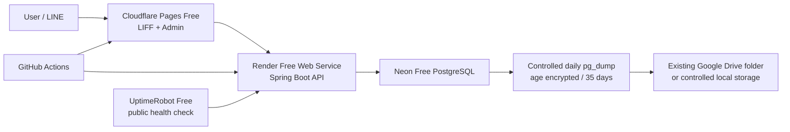

# S11 Zero-Cost Runtime Architecture Correction

## Decision and hard boundary

The current active test/pilot runtime is **zero additional monetary cost**. Google Workspace or Google One must not be interpreted as Google Cloud Billing. Therefore Cloud Run, Cloud SQL, GCS, and paid GCP usage are not an active deployment path.

**ZERO-COST HARD GATE:** no provider may be automatically upgraded to a paid plan. Prefer quota exhaustion, suspension, or build disablement to surprise billing. Do not add a payment method merely to avoid a free-tier suspension. The maintainer must periodically check provider dashboards for plan, quota, and payment-method state; repository evidence cannot prove those live account facts.

## Active pilot and provider boundaries

| Component | Active pilot target | Boundary |
| --- | --- | --- |
| LIFF / Admin | Existing Cloudflare Pages Free provider domains | Static assets only; do not add Pages Functions unless separately approved and kept inside Free limits. |
| API | Existing `pickleball-stg-api` Render Free Java 21 Docker web service | Cold wake-up and single-instance operation are expected; no persistent disk, worker, cron/job, or autoscaling. |
| Database | Existing `pickleball-stg` Neon Free PostgreSQL | Pilot-scale PostgreSQL only; monitor quota and keep independent backups. |
| Monitoring | Existing UptimeRobot Free public health monitor | Five-minute health cadence mitigates idle wake-ups; it is not an SLA. |
| CI | GitHub Actions | Repository CI only; it creates no persistent paid runtime resource. |

The existing staging LINE Login/LIFF environment remains the active pilot identity environment. This task creates no separate LINE resource. A no-cost, separate production LINE channel remains a later S11.2 configuration decision; it is not required for this pilot runtime.

## Free-tier safety policy

- **Render:** retain the Free compute plan; do not create a persistent disk, background worker, cron job, autoscaling service, or paid plan. Render documents that a workspace with a payment method can incur supplementary bandwidth/build charges; without one, the free services/builds are suspended or disabled when included quota is exhausted. Verify the monthly spend limit where the dashboard exposes it.
- **Neon:** retain the Free plan and do not approve a paid-plan upgrade. Free egress exhaustion suspends compute until the next cycle or an explicit upgrade. Review storage, compute, and public-transfer consumption before it reaches the hard gate.
- **Cloudflare Pages:** retain the Free plan and static-site model. Avoid Pages Functions, whose requests consume Workers quota. Do not change account plan to increase Pages limits.
- **UptimeRobot:** retain the Free plan and the public, read-only health check only; do not add paid monitors or integrations.

## Render Free compatibility

Repository evidence identifies `pickleball-stg-api` as a Free Java 21 Docker API with `SPRING_FLYWAY_ENABLED=false` and `WORKERS_ENABLED=false`. The architecture stores no business state on the container filesystem, so a Free service restart/spin-down does not lose application data. Render Free web services can spin down after 15 idle minutes and take roughly a minute to wake; they are not a production-grade HA service and cannot scale beyond one instance.

No Render dashboard or metrics connector is available to this review, so the current plan, memory usage, absence of a paid disk/worker/cron, and quota consumption are not independently verified live facts. Before treating the existing service as pilot-ready, the maintainer must verify them in Render. No JVM tuning is committed without memory evidence. If a verified 512 MiB allocation shows heap/GC pressure, a focused follow-up may evaluate a conservative `JAVA_TOOL_OPTIONS` `MaxRAMPercentage` cap and validate readiness/CI; it must not upgrade the plan.

## Neon Free compatibility

The repository's existing Neon staging design is PostgreSQL-compatible, TLS-required, and Flyway/logical-backup compatible, so it is technically suitable for a low-traffic pilot. Live quota consumption cannot be confirmed without Neon account access.

Current Neon Free limits to monitor are 0.5 GB storage per project, 100 CU-hours per project per month, 5 GB/month public egress, scale-to-zero after inactivity, and a limited restore/time-travel window. Application traffic should use the provider-approved pooled connection where configured; Flyway migrations, `pg_dump`, and `pg_restore` require a direct non-pooler connection. The free restore window is supplementary only, never the sole recovery control.

## Data safety and recovery classification

The independent recovery control is a controlled daily `pg_dump --format=custom`, immediate `age` encryption, and 35 retained archives. Keep archives outside Git and outside the repository. Store only encrypted archives and non-secret metadata in an existing controlled Google Drive project folder or controlled local backup location; keep the age private identity offline/separate. If a safe Google Drive upload integration is not already configured, upload encrypted archives manually rather than creating credentials or automation.

The existing `scripts/staging-backup.ps1` already requires explicit confirmation, external backup storage, TLS, an age recipient, immediate encryption, plaintext cleanup, and configurable retention. Use its `RetentionCount` of 35 only in the approved pilot procedure; do not commit dumps, archive paths, connection strings, or private identities.

For the zero-cost pilot, recovery objectives are reclassified to **RPO <= 24 hours** (daily independent logical backup) and **RTO best effort, target <= 8 hours** (manual restore by the solo maintainer). These are not guarantees and are weaker than the deferred Cloud SQL profile. A restore rehearsal is required before any stronger claim.

## Domains, GCP reference, and upgrade triggers

Pilot LIFF/Admin use the existing Cloudflare Pages HTTPS domains and the API uses the existing `onrender.com` HTTPS domain. A custom domain is optional future work; none is purchased or required by this decision.

`infra/terraform/environments/production` remains a CI-validated **FUTURE PAID PRODUCTION UPGRADE PATH**, not the current zero-cost pilot runtime. S11.1C GCP provisioning is `DEFERRED`. It can be activated only through a new explicit maintainer architecture/cost authorization.

Return to architecture/cost approval, without automatic upgrade, when any of these occurs:

- Render Free suspension, cold starts, single-instance limits, or quotas materially disrupt pilot users;
- Neon storage reaches 70% of its Free quota, or compute/egress quotas recur;
- restore requirements exceed Neon Free plus daily logical-backup capability;
- user volume or paid transactions become business-critical; or
- a formal uptime/SLA, stronger recovery objective, private networking, or compliance control is required.

## Non-actions

This correction creates no GCP project, billing attachment, Cloud SQL, Cloud Run, GCS bucket, paid Render service, Neon upgrade, Cloudflare upgrade, domain, paid monitor, production credential, or LINE resource. It does not invoke Terraform apply or a live Terraform plan, and it leaves staging runtime configuration unchanged.
