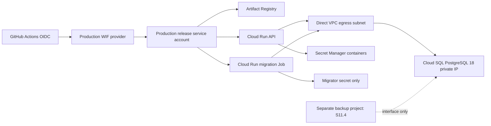

# S11.1A Production IaC Foundation

## Status and boundary

S11.1A is a repository-only Terraform foundation. It defines a production root at `infra/terraform/environments/production`; it does not run `terraform apply`, create a project, enable an API, create a secret version, deploy an image, or modify staging. Production provisioning remains a separate explicit maintainer authorization.

The root structurally requires different `runtime_project_id` and `backup_project_id`; its resource names use `pickleball-prod`, and no staging variable or state backend is reused. The staging Terraform roots remain unchanged.

## Target graph

## Cloud Run to Cloud SQL decision

S11.1A chooses **Cloud SQL private IP plus Cloud Run Direct VPC egress**. The API and migration Job each attach to a dedicated subnet with `PRIVATE_RANGES_ONLY`; Cloud SQL has `ipv4_enabled = false`. This avoids public database exposure and avoids a Serverless VPC Access connector. Google recommends private IP when an internet-accessible instance is unnecessary, and identifies Direct VPC egress as the recommended Cloud Run egress option.

The application connects directly to the private IP on PostgreSQL `5432` over TLS (`sslmode=require`). This is intentionally not a Cloud SQL Auth Proxy/socket design: the private VPC path is the supported selected boundary. Required provisioning dependencies are a custom VPC, subnet, Private Services Access reserved range, service networking connection, private-IP Cloud SQL instance, and API/Job Direct VPC egress configuration. Primary failure modes are exhausted subnet/reserved ranges, a missing service networking connection, invalid egress attachment, DNS/IP configuration, database credential rotation, and Cloud SQL capacity/failover; S11.7 owns alerts and runbooks.

## IAM and deployment identities

| Identity | Authority | Explicit exclusions |
| --- | --- | --- |
| `pickleball-prod-api` | Read only its runtime, JWT, and LINE Secret Manager secrets; access the private DB network | No migrator secret, DDL, role administration, Terraform state, or GitHub federation |
| `pickleball-prod-migration` | Read only the migrator password; private DB network | No application/JWT/LINE secret, no public service, no runtime use |
| `pickleball-prod-release` | Artifact Registry write, Cloud Run administration, attach only API/migration service accounts | No Owner/Editor, Secret Manager access, DB password, or Terraform state access |
| foundation operator | Manually approved provisioning identity | Not represented as a broad CI identity; exact IAM is an approval-time ceremony |

GitHub authentication uses a repository-and-protected-branch constrained Workload Identity Federation provider, not a downloadable service-account key. The provider accepts only `heyi0819/Pickleball-Booking-Platform` and the configured release branch. The deployment workflow itself is intentionally deferred until a later approved release slice.

## Database identities and migration boundary

Terraform creates neither database passwords nor `google_sql_user` resources. Password payloads must be created outside Terraform state through the approved secret ceremony. Before the first migration, an operator creates these database identities with a reviewed, non-repository procedure:

| Database login | Required authority | Prohibited authority |
| --- | --- | --- |
| `pickleball_migrator` | `CONNECT`, schema `USAGE`/`CREATE`, ownership of Flyway-created objects, default grants to app role | Runtime use, role administration beyond reviewed bootstrap |
| `pickleball_app` | `CONNECT`, schema `USAGE`, required tables/sequences DML only | Schema ownership, DDL, role management, migrator secret |
| `backup_operator` | Read-only logical backup rights, provisioned in S11.4 | DML/DDL, runtime/migration use |

The Cloud Run Job receives only the migrator database secret and runs the non-web `migration` Spring profile with Flyway enabled and validation-on-migrate. Spring exits non-zero when migration/validation fails. The API always sets `SPRING_FLYWAY_ENABLED=false`; it has no migrator secret and cannot invoke arbitrary migrations. The release process must verify `flyway_schema_history` and application grants before the API revision is promoted.

## Secrets

Terraform creates resource containers only for runtime password, migrator password, JWT signing material, LINE Login channel secret, and LINE Messaging credential. It creates no secret version/payload. `VITE_*`, image references, CORS origins, LINE channel IDs, and redirect URLs are public configuration—not Secret Manager material.

## State ownership

Production Terraform state uses a dedicated, versioned GCS bucket configured only through `backend.hcl` at `terraform init`. The bucket name is not embedded in source. State access must be restricted to an audited production infrastructure group; CI release identity receives no state permission. GCS object generation preconditions provide Terraform's state locking/concurrency behaviour. No secret payload is intentionally stored in state; operators must review plans to ensure an unexpected provider field does not introduce one.

## Backup project interface

S11.1A accepts a distinct backup project ID, bucket location, writer identity concept, and retention-days input only. It creates no bucket, IAM binding, encryption key, backup schedule, or restore path. S11.4 owns those resources and the restore rehearsal. `35` days in the example is a proposed input, not a final RPO/RTO contract.

## Monitoring foundation and cost drivers

All managed runtime resources receive application/environment/managed-by labels for future monitoring and billing attribution. S11.7 owns alert policy, routing, and incident evidence.

| Service | Main cost drivers | Minimum viable profile | Recommended production profile | Upgrade trigger |
| --- | --- | --- | --- | --- |
| Cloud Run | CPU, memory, min instances, requests, egress | min 0, bounded max | min instances only after latency evidence | cold starts or sustained saturation |
| Cloud SQL | tier, HA mode, SSD, auto-growth, backup/PITR | ZONAL after explicit approval | REGIONAL after availability/cost approval | RTO/SLA requires HA or capacity exceeds tier |
| Network | private services range, egress, logging | Direct VPC, private-ranges-only | flow/log controls after S11.7 design | observability/security policy requires it |
| Monitoring | log/metric ingestion, uptime checks | labels only | S11.7 alert catalog | incident response requirements |
| Backup | storage, retention, restore egress | interface only | S11.4 encrypted cross-project backup | RPO/retention approval |

No exact monthly bill is stated because region, Cloud SQL tier/HA, traffic, min instances, retention, and logging volume remain unapproved inputs.

## Provisioning order and rollback boundary

1. Approve region, cost profile, state bucket ownership, dual custodians, and project IDs.
2. Separately create runtime/backup projects and audited remote-state bucket.
3. Apply the foundation root using an approved human foundation identity; create secret payloads outside Terraform state.
4. Create and validate DB logins/grants through a reviewed bootstrap procedure.
5. Publish immutable image digest, execute migration Job, verify Flyway/app grants, then deploy compatible API revision.
6. S11.2 creates production LINE/Cloudflare resources; S11.4 implements backup; S11.7 implements alerts; S11.5 provides privileged-role bootstrap.

Before any apply, a repository-only rollback is a normal Git revert. After provisioning, do not destroy Cloud SQL or use destructive down migrations. API rollback is permitted only against a compatible migrated schema; schema/data faults require a reviewed forward-fix. Database deletion protection defaults to enabled.

## Unresolved decisions

- Approved GCP region and corresponding PostgreSQL 18 availability.
- Cloud SQL tier, disk, ZONAL versus REGIONAL HA, and final RPO/RTO.
- Production state bucket project/location and foundation-operator group.
- Production backup project bucket/KMS/retention and dual-custodian availability.
- Final production LIFF/Admin domains, LINE IDs, redirect URI, and Cloudflare Access/IP policy.
- Cloud Run min/max instance capacity and whether production workers are enabled.
