# Staging CD Bootstrap Runbook

This runbook implements the repository-side baseline required by `09-Deployment-DevOps` and `10-Development` for the Pickleball Booking Platform.

## Scope

The staging baseline uses:

- GCP region: `asia-east1`
- Cloud SQL for PostgreSQL 18
- Artifact Registry Docker repository
- Cloud Run API Service
- Cloud Run Migration Job using the same backend image digest
- Firebase Hosting sites for LIFF and Admin
- Secret Manager for runtime secrets
- GitHub Actions + Google Workload Identity Federation (WIF)
- Terraform with GCS remote state

No service-account JSON key and no application secret value is committed to Git or stored in Terraform configuration.

## Deployment sequence

```mermaid
flowchart LR
    A[CI on main PASS] --> B[Build backend image]
    B --> C[Push Artifact Registry]
    C --> D[Resolve immutable image digest]
    D --> E[Terraform update Migration Job]
    E --> F[Execute Flyway Migration Job]
    F --> G[Terraform deploy API using same digest]
    G --> H[Build LIFF and Admin]
    H --> I[Deploy Firebase Hosting]
    I --> J[Staging smoke]
    J --> K[Release candidate metadata]
```



The API runtime sets `SPRING_FLYWAY_ENABLED=false`. Database migration is executed only by the migration job. This prevents multiple Cloud Run API replicas from racing to migrate the database.

## 1. One-time GCP staging foundation

The GCP project itself must already exist and billing must be enabled before Terraform can enable APIs or create managed services.

Copy the example variables:

```bash
cd infra/terraform/bootstrap/staging-foundation
cp terraform.tfvars.example terraform.tfvars
```

Fill these values:

- `project_id`
- `terraform_state_bucket_name` — globally unique
- `firebase_liff_site_id` — globally unique
- `firebase_admin_site_id` — globally unique

Authenticate locally with a privileged bootstrap identity that can enable APIs, manage IAM, Cloud SQL, Firebase, Artifact Registry, Secret Manager, GCS and WIF. Do not create or download a long-lived service-account JSON key for GitHub.

First initialize without a backend because the state bucket does not exist yet:

```bash
terraform init -backend=false
terraform fmt -check
terraform validate
terraform plan
terraform apply
```

After the state bucket has been created, migrate the local foundation state into GCS:

```bash
terraform init -migrate-state \
  -backend-config="bucket=<terraform_state_bucket_name>" \
  -backend-config="prefix=bootstrap/staging-foundation"
```

Record these Terraform outputs:

- `workload_identity_provider`
- `deployer_service_account_email`
- `terraform_state_bucket`
- `firebase_liff_site_id`
- `firebase_admin_site_id`

## 2. Add secret values outside Terraform

Terraform creates only the Secret Manager secret resources. Secret payloads must be added separately so plaintext values do not enter Terraform state.

Required secrets:

- `pickleball-stg-db-password`
- `pickleball-stg-jwt-signing-secret`

Example using Google Cloud CLI from a secure local shell:

```bash
printf '%s' "$DB_PASSWORD" | \
  gcloud secrets versions add pickleball-stg-db-password \
  --project="$PROJECT_ID" --data-file=-

printf '%s' "$JWT_SIGNING_SECRET" | \
  gcloud secrets versions add pickleball-stg-jwt-signing-secret \
  --project="$PROJECT_ID" --data-file=-
```

Do not place these values in `terraform.tfvars`, GitHub repository variables, frontend environment variables, or committed configuration.

## 3. Create the Cloud SQL application user

The application DB user password deliberately is not managed by Terraform because Cloud SQL user passwords are persisted in Terraform state when supplied to the `google_sql_user` resource.

Create the application user using the value already stored in Secret Manager:

```bash
DB_PASSWORD="$(gcloud secrets versions access latest \
  --project="$PROJECT_ID" \
  --secret=pickleball-stg-db-password)"

gcloud sql users create pickleball_app \
  --project="$PROJECT_ID" \
  --instance=pickleball-stg-pg18 \
  --password="$DB_PASSWORD"

unset DB_PASSWORD
```

## 4. Configure the GitHub `staging` Environment

Create a protected GitHub Environment named `staging` and set the following **environment variables**:

| Variable | Source |
|---|---|
| `GCP_STAGING_PROJECT_ID` | GCP project ID |
| `GCP_STAGING_WIF_PROVIDER` | Terraform `workload_identity_provider` output |
| `GCP_STAGING_DEPLOYER_SA` | Terraform `deployer_service_account_email` output |
| `GCP_STAGING_TF_STATE_BUCKET` | Terraform `terraform_state_bucket` output |
| `STAGING_LIFF_SITE_ID` | Terraform `firebase_liff_site_id` output |
| `STAGING_ADMIN_SITE_ID` | Terraform `firebase_admin_site_id` output |
| `STAGING_LIFF_ID` | LINE Developers staging LIFF ID |
| `STAGING_LINE_LOGIN_CHANNEL_ID` | LINE Login staging channel ID |

Application secret payloads stay in Secret Manager and are **not** copied into GitHub.

## 5. Staging runtime state

The runtime root is:

```text
infra/terraform/environments/staging
```

GitHub Actions initializes it with:

```text
bucket = GCP_STAGING_TF_STATE_BUCKET
prefix = runtime/staging
```

Runtime Terraform manages:

- `pickleball-stg-db-migrate` Cloud Run Job
- `pickleball-stg-api` Cloud Run Service
- public Cloud Run invoker boundary for staging; Spring Security still protects application endpoints
- Secret Manager references, not secret payloads

## 6. Automatic deployment gate

`.github/workflows/deploy-staging.yml` runs only after the `CI` workflow has completed successfully on `main`. It also supports a manual `workflow_dispatch` from `main` for recovery/retry.

The workflow:

1. validates all required staging GitHub variables;
2. authenticates using OIDC/WIF;
3. verifies required Secret Manager versions exist;
4. builds one backend container image;
5. pushes it to Artifact Registry and resolves its immutable digest;
6. updates and executes the migration job;
7. deploys the API using the same digest;
8. builds LIFF/Admin with staging LINE identifiers;
9. deploys both Firebase Hosting targets;
10. executes `scripts/staging-smoke.sh`;
11. uploads release-candidate metadata containing Git SHA, image digest, URLs and migration job name.

## 7. Smoke acceptance

The staging smoke verifies:

- Cloud Run `/actuator/health/readiness` is `UP`;
- LIFF Hosting returns successfully;
- Admin Hosting returns successfully;
- both Hosting `/api/**` rewrites reach the backend;
- protected `/api/v1/me` without a token returns `401`, proving the Spring Security boundary remains active.

This is the infrastructure smoke gate. Slice-specific P0 journeys still remain in the normal Playwright CI suite; future staging test-data automation can extend this smoke into authenticated real-environment P0 journeys without changing the deployment architecture.

## 8. Known bootstrap boundary

Repository code alone cannot prove the staging gate. Formal acceptance requires an actual GCP staging project, Secret Manager versions, Cloud SQL user, LINE staging configuration and GitHub `staging` Environment values.

Do not mark Slice 6 closed until a real `Deploy Staging` workflow run has passed and its release-candidate metadata has been recorded.
