# Zero-Cost Cloud / NAS-ready Deployment Baseline

This repository follows the 2026-08-27 approved deployment backfill in the authoritative Google Drive `09-Deployment-DevOps`, `10-Development`, and `06-API-Spec` documents.

## Decision

The current development and initial production target is **zero recurring cloud cost**.

Rules:

- standard GitHub Actions on the public repository is the CI execution plane;
- no merge or CI workflow may automatically create a resource that can generate cloud charges;
- paid-cloud deployment must be manual and explicitly enabled for that single run;
- when a free quota is exhausted, fail closed / suspend instead of auto-upgrading to paid usage;
- application design remains portable so the online free-tier providers can be replaced later without rewriting business logic;
- a future home NAS is a migration target, not a current implementation requirement.

## Repository gate

The CI pipeline runs the existing Backend / Frontend / PostgreSQL / Security / Browser gates and finishes with a production-like ephemeral environment:

```mermaid
flowchart LR
    A[Backend + Frontend + Migration + DevOps PASS] --> B[Build React production bundles]
    B --> C[Start ephemeral PostgreSQL 18]
    C --> D[Build backend Docker image]
    D --> E[Run dedicated Flyway migration container]
    E --> F[Start API from the same image]
    F --> G[Readiness + Spring Security smoke]
    G --> H[Write RC metadata]
    H --> I[Destroy all ephemeral resources]
```



The executable harness is `scripts/zero-cost-production-like.sh`.

It verifies:

- a clean PostgreSQL 18 instance becomes ready;
- the production backend Docker image builds;
- Flyway migration executes in a dedicated container;
- the latest applied Flyway version matches the highest versioned migration in the fixed commit;
- the API starts from the same image with startup Flyway disabled;
- `/actuator/health/readiness` reports `UP`;
- unauthenticated `/api/v1/me` returns `401`;
- release metadata records that no persistent cloud resource or paid cloud is required.

This ephemeral gate is the current Staging / production-like acceptance gate for Slice closure.

## Online zero-cost production profile

The actual public Internet environment is provider-neutral at repository level. At deployment time, choose services that satisfy all of the following:

### Frontend

- static HTTPS hosting for the LIFF and Admin React builds;
- a free plan suitable for the expected low traffic;
- no mandatory automatic paid overage;
- frontend API URL supplied by environment/build configuration.

### Backend

- can run the repository's Java 21 Docker image or an equivalent container deployment;
- accepts environment variables / secrets without committing them;
- supports HTTPS exposure;
- free quota may sleep or suspend when exhausted rather than charging automatically.

### Database

- standard PostgreSQL compatible with the repository's Flyway migrations;
- no application dependency on vendor-specific data APIs;
- supports standard PostgreSQL connection strings and logical backup/export;
- free quota must not silently convert into paid usage.

Provider choice is intentionally deferred until the online environment is provisioned because free-tier terms can change. The application contract must not depend on the selected provider.

## Portability rules

### Backend

- stateless application runtime;
- no business state stored on the container filesystem;
- Docker image is the deployment artifact;
- `DATABASE_URL`, credentials, JWT / LINE configuration, and other runtime values are injected by environment.

### Database

- PostgreSQL is the system of record;
- schema changes use Flyway versioned migrations;
- backup / migration must remain compatible with standard PostgreSQL logical export / restore;
- avoid vendor-only schema or data-access features unless an approved portability adapter exists.

### Frontend

- no hard-coded hosting vendor URL;
- API base URL and LIFF identifiers are environment/build inputs;
- React business UI must not rely on a hosting-provider proprietary runtime API.

## Future NAS migration target

No NAS-specific code is required now. A future migration should be possible as:

```text
same React build
same Java 21 Spring Boot Docker image
standard PostgreSQL pg_dump / restore
new environment variables / networking
```

Synology/QNAP APIs, home-network tunnels, RAID layout, NAS monitoring, and NAS-specific deployment automation are deliberately deferred until a NAS actually exists.

## Finance scope

Slice 6 records receivables, manual payments, and manual refund lifecycle only.

- `CASH` is the primary/default MVP payment method;
- an existing `BANK_TRANSFER` or similar method means an off-platform manual transaction was completed and then recorded;
- the backend does not initiate bank transfers or payment-provider transactions;
- there is no card token, merchant secret, payment-provider webhook/callback, or gateway reconciliation requirement in MVP;
- Finance endpoints remain high-risk administrative operations and keep authorization, organization scope, audit, idempotency, and concurrency controls.

## Paid GCP reference

The Terraform roots under `infra/terraform` remain an optional reference for a future explicitly approved paid GCP environment.

`.github/workflows/deploy-staging.yml` is intentionally **manual-only** and requires the input `ENABLE_PAID_GCP`. It must never be treated as a normal main-branch deployment or Slice closure requirement.

## Slice 6 closure sequence

```text
PR #27 repository baseline CI PASS
→ explicit PR #27 Merge Gate
→ PR #26 Finance Closure Gate
→ main CI including zero-cost production-like smoke
→ Slice 6 Closure Review
→ update Project Progress Control
→ start Slice 7
```

Do not close Slice 6 or start Slice 7 before that sequence passes.
